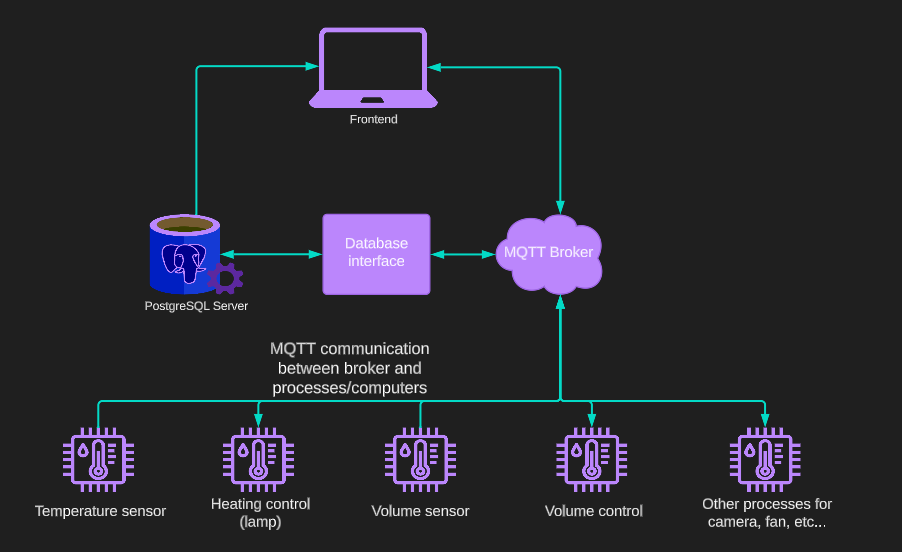
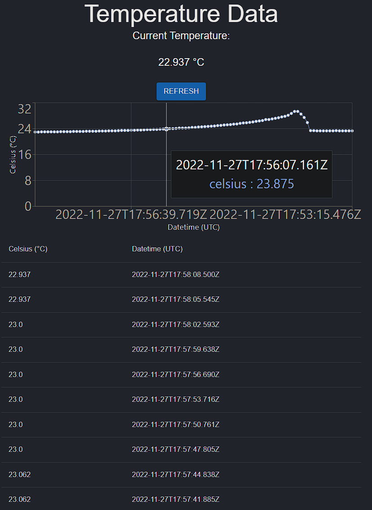
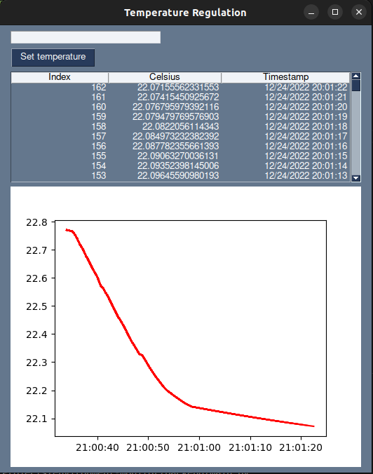

# environment-monitor
Full stack app to log temperature and other environment data using a raspberry pi and a database, and display the data on a webpage with an api and javascript/react.

Flowchart link: https://lucid.app/lucidchart/7a6a0ca2-b669-4ce4-a853-eb6cf9726adc/edit?viewport_loc=-11%2C-11%2C1795%2C1527%2C0_0&invitationId=inv_dcab5a53-3bb8-4d6e-b0b8-660656aa0594

Python code adheres to the PEP8 standard 

# Demo webpage: 

# Demo desktop app: 

# Todo:
    Frontend:
    - Login functionality
    - Filter by date
    - Chart :white_check_mark:
    - Alerts
    - Export temperature data

    Backend: 
    - Docker
    - Kybernetes
    - Control temperature with output device, for example lamp
